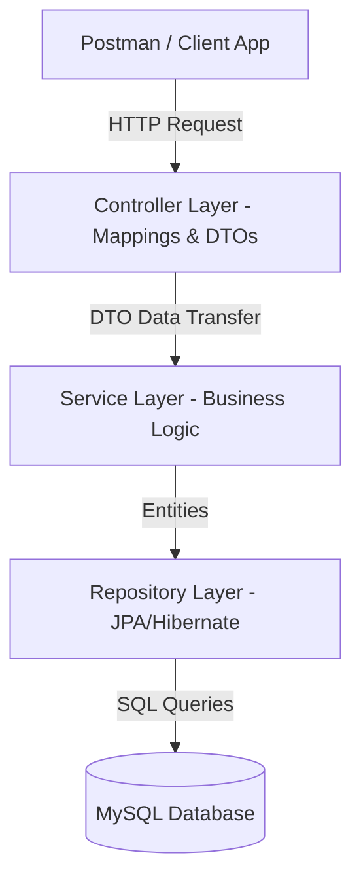

# Spring Boot Backend Architecture Suite 🚀

A master repository cataloging progressive backend systems built with **Java** and the **Spring Boot** ecosystem. This repository demonstrates core competencies in RESTful API design, database integration (JPA/Hibernate/MySQL), and server-side security architectures.

---

## 📂 Architecture Catalog

The repository is structured into 19 specialized modules categorized by architectural focus:

### 1. Security & Authentication Engines (Core Backend Depth)
* **`sb-15-jwt-token-creation` & `sb-15-jwt-token-creation-2`:** Implemented a stateless token authentication system. Features token creation, custom claims signing, validation using HS256, and intercepting requests via a JWT Filter.
* **`sb-13-otp-auth`:** Designed a multi-factor authentication (MFA) workflow using dynamic OTP generation, secure session verification, and expiry validation.
* **`sb-12-role-based-auth`:** Configured Role-Based Access Control (RBAC) in Spring Security to isolate access controls between Admin and User scopes.
* **`sb-16-backend-login-app` & `sb-17-registration-app`:** Secure authentication endpoints utilizing password hashing via BCrypt encoder and persistent MySQL storage.
* **`sb-14-web-filter`:** Custom filter chain implementations processing incoming requests to validate request headers, log execution times, and filter unauthorized requests.

### 2. RESTful Service Design & Persistence Layer
* **`sb-11-employee-management-system`:** A production-pattern implementation of a database-backed management system utilizing the **Controller-Service-Repository** design pattern. Includes custom query methods, transaction management, and validation.
* **`sb-10-employeeAPI`:** Clean RESTful API exposing endpoints with standard HTTP status code structures, custom exception handlers, and DTO validations.
* **`sb-06-service-layer` & `sb-07-requests`:** Showcases complete separation of concerns by handling web mappings in controllers and executing business logic inside service components.

### 3. MVC & Web Engine Fundamentals
* **`sb-04-web-app-thymeleaf` & `sb-05-thymeleaf-dynamic-web-controller`:** Dynamic web rendering implementations using Thymeleaf templates integrated with Spring MVC models.
* **`sb-01-basics` to `sb-03-web-app`:** Core IoC (Inversion of Control) container examples, Dependency Injection (DI) strategies, and basic controller setups.

---

## 🛠️ Stack & Ecosystem
* **Core Framework:** Spring Boot (v3.x), Spring MVC
* **Security:** Spring Security, JWT (io.jsonwebtoken), BCrypt Hashing
* **Data & Persistence:** Spring Data JPA, Hibernate ORM, JDBC, MySQL
* **Build Tool & Testing:** Maven, Postman API Testing Suite

---

## 🏗️ Architectural Blueprint

All major backend applications in this suite follow a modular, layered clean architecture:



### Key Architectural Decisions:
1. **Separation of Concerns:** Business logic is isolated from controllers inside `@Service` components, ensuring modularity.
2. **Stateless Security Model:** JWT authentication prevents session overhead, allowing server horizontal scaling.
3. **Database Constraints:** Relational mappings (One-to-Many, Many-to-One) are managed strictly using JPA annotations with cascade rules configured to protect database integrity.

---

## 🚀 Setup & Execution Instructions

### Prerequisites
* Java JDK 17 or above
* Maven 3.8+
* MySQL Server (running locally or in a container)

### Step 1: Configure Database Connection
Create a MySQL database:
```sql
CREATE DATABASE employee_db;
```
Open the target sub-project configuration `src/main/resources/application.properties` and update properties:
```properties
spring.datasource.url=jdbc:mysql://localhost:3306/employee_db?useSSL=false
spring.datasource.username=your_mysql_username
spring.datasource.password=your_mysql_password
spring.jpa.hibernate.ddl-auto=update
```

### Step 2: Build & Run
From the root of the target sub-project directory:
```bash
mvn clean install
mvn spring-boot:run
```

---

## 📬 API Sample Endpoint Mapping
All core APIs (such as `sb-10-employeeAPI`) expose the following structured RESTful contracts:

| Verb | Endpoint | Action | Access |
| :--- | :--- | :--- | :--- |
| **POST** | `/api/auth/register` | Register new user account | Public |
| **POST** | `/api/auth/login` | Authenticate credentials & return JWT | Public |
| **GET** | `/api/employees` | Retrieve all records | User / Admin |
| **GET** | `/api/employees/{id}` | Retrieve employee by ID | User / Admin |
| **POST** | `/api/employees` | Create new database record | Admin Only |
| **DELETE**| `/api/employees/{id}` | Cascade delete database record | Admin Only |
